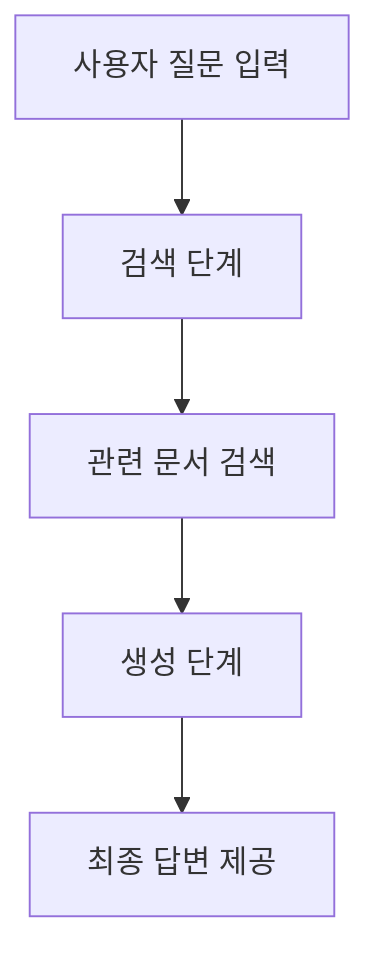

# RAG (Retrieval-Augmented Generation)

## RAG란?

RAG는 Retrieval-Augmented Generation의 줄임말로, 
기존의 자연어 생성 모델에 정보를 검색해오는 기능을 결합한 기술입니다. 
이 기술은 미리 학습된 언어 모델의 성능을 개선하기 위해, 추가적인 정보 검색을 통해 보다 정확하고 관련성 높은 응답을 생성할 수 있도록 합니다.

쉽게 말하면, 언어 모델이 모르거나 충분하지 않은 정보를 대답할 때,
외부의 검색 엔진을 사용해 필요한 정보를 찾아보고 그 정보를 바탕으로 답변을 생성하는 것입니다.

## RAG의 작동 방식

1. **검색 (Retrieval)**:
   - 사용자가 질문을 입력하면, 우선 검색 모델이 해당 질문과 관련된 문서나 정보를 검색합니다.
   - 검색 모델은 일반적으로 'Dense Retriever'라는 기술을 사용하여, 질문과 관련성 높은 문서들을 데이터베이스나 외부 자료에서 찾습니다.

2. **생성 (Generation)**:
   - 검색된 문서들을 바탕으로 언어 생성 모델이 답변을 생성합니다.
   - 이 과정에서 검색된 정보들을 이용하여, 더 신뢰성 있고 풍부한 답변을 만들어낼 수 있습니다.

이렇게 두 단계를 결합함으로써, 단순한 언어 모델이 할 수 있는 것보다 훨씬 더 정확하고 정보가 풍부한 답변을 제공할 수 있습니다.

## RAG의 장점

- **더 정확한 정보 제공**: 모델이 대답할 수 없는 정보를 외부에서 검색하여 사용함으로써, 단순한 언어 모델보다 정확하고 신뢰성 있는 답변을 제공할 수 있습니다.
- **유연한 확장성**: 검색에 사용하는 데이터베이스를 자유롭게 설정할 수 있어, 특정 도메인에 최적화된 답변 생성이 가능합니다.
- **최신 정보 활용**: 학습된 모델에 포함되지 않은 최신 정보도 검색을 통해 포함할 수 있습니다.

## 예시

예를 들어, 여러분이 "2024년 노벨상 수상자는 누구인가요?" 라고 질문한다고 가정해 봅시다. 
기존의 언어 모델은 학습된 정보까지만 알기 때문에 최신 정보인 2024년 수상자를 모를 수 있습니다. 
하지만 RAG 모델은 인터넷이나 최신 데이터베이스에서 2024년 수상자를 검색한 뒤, 그 정보를 바탕으로 대답을 생성할 수 있습니다.

## 그림으로 보는 RAG

## 요약

RAG는 검색과 언어 생성의 결합으로, 사용자가 원하는 질문에 대해 보다 정확하고 풍부한 정보를 제공하는 기술입니다. 최신 정보와 유연한 데이터베이스를 활용할 수 있다는 점에서 기존의 언어 모델을 한층 더 업그레이드한 방식이라 할 수 있습니다.

## 참고 자료
- [RAG 논문 원문](https://arxiv.org/abs/2005.11401)

---
